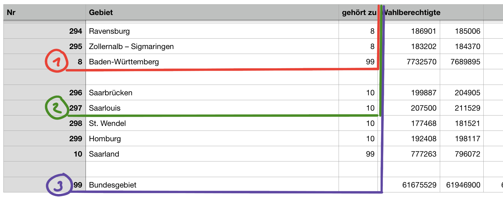
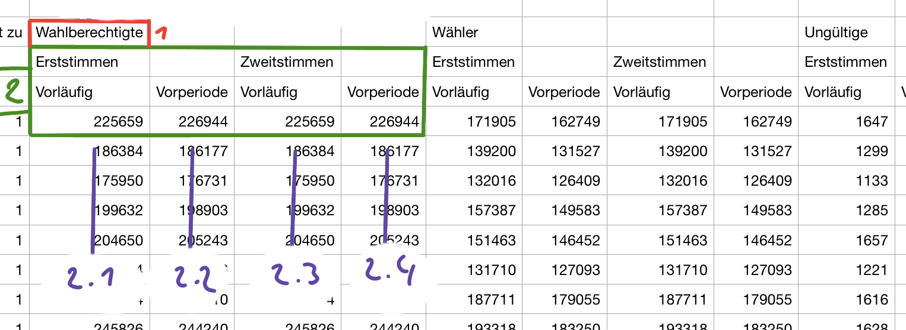
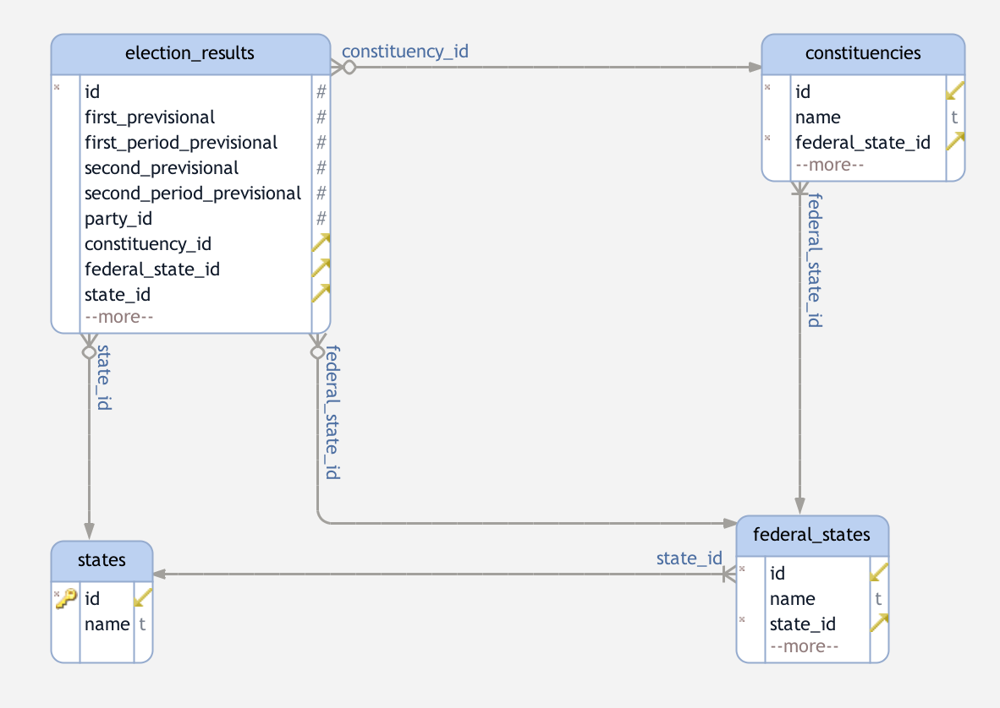

1. [Installation](#1.-Installation)
2. [Parsing btw17_kerg.csv](#2.-Parsing-btw17_kerg.csv)
3. [Representation as View](#3.-Representation-as-View)

# 1. Installation

download the repository

    git clone git@github.com:SebastianKapunkt/german-election-viewer.git

cd into the project

    cd german-election-viewer

install requirements

    german-election-viewer$: pip install -r requirements.txt

install node dependencies

    german-election-viewer$: cd WebApp
    german-election-viewer/WebApp$: npm install
    
build angular2 typescripts

    german-election-viewer/WebApp$: npm start


set envirement varaible

    german-election-viewer$: export FLASK_APP=app/__init__.py

start the flask server from root folder

    german-election-viewer$: flask run

open localhost

    http://localhost:5000/


# 2. Parsing btw17_kerg.csv

Before we started to parse we had to figure out how the csv is structured. To make it more human readable we opened it in 'Numbers'.

## Identify rows

First we identified what a federal state is and what a constituency.



1. A **federal state** has at column "gehört zu" the number '99'.
2. A **constituency** has at column "gehört zu" a number between 0-17
3. Also with looking further we found that the **state** (eg. germany) is to identify when the column "Nr" had the value '99' and the column "gehört zu" was empty.

## Identify columns
The next step is to figure out the structure of the columns after "gehört zu"



1. The type or name of block. This is usally the name of the party where the numbers belong to. Except for the first 4 cases where it is a more general aggregation: Wahlberechtigte, Wähler, Ungültige & Gültige.

2. Each block includes 4 numbers.
    1. "Erststimmen Vorläufig"
    2. "Erststimmen Vorperiode"
    3. "Zweitstimmen Vorläufig"
    4. "Zweitstimmen Vorperiode"

## parsing

1. The first thing we do is getting the name of all "Party"-blocks. We just paste the 4th row into an array.
```python
def get_parties(rows):
    parties = []
    index = 3
    while index < len(rows[2]) - 1:
        parties.append(Party(name=rows[2][index]))
        index += 4
    return parties
```

2. Now we can go row by row and apply what we figured out to identify which row is what.
    1. federal state
    ```python
    elif int(row[2]) == 99:  # federal_state it self
    ```
    2. constituency
    ```python
    elif int(row[2]) in range(17): #constituencies
    ```
    3. the state
    ```python
    if row[2] == '' and row[0] == '99':  # state it self
    ```

3. We have the names of the parties and can identify each row. To continue we had to setup a database model.



4. How all this works together can be seen in ```election_reader.py```

# 3. Representation as View
